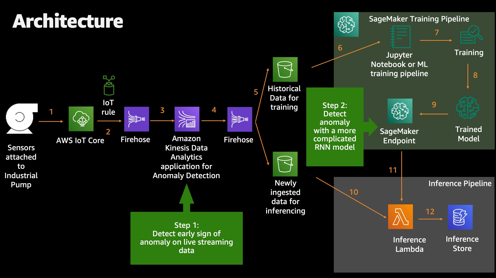

# predict_anomaly_reInvent_2020
The repo of 2020 predict anomaly on IoT data session demo. Thanks for attending 2020 reInvent!

### Architecture Diagram


## Guide to set up entire platform
### Pre-requisites
1. AWS CLI installed on your local machine
   - To install AWS CLI: https://docs.aws.amazon.com/cli/latest/userguide/install-cliv2.html
2. AWS SAM CLI installed on your local machine
   - To install AWS SAM CLI: https://docs.aws.amazon.com/serverless-application-model/latest/developerguide/serverless-sam-cli-install.html
3. Be an AWS account admin user

### Launch cloud architecture before Sagemaker
#### Step 1: Clone repo and configure environment
If you have not done so, configure your AWS CLI with a profile linked to your account.
```
aws configure --profile ANY_NAME_YOU_LIKE
```

Next, please clone this repo onto any PATH onto your machine.
```
git clone CURRENT_REPO
cd 
```

Once you successfully cloned this repo, please edit deploy.env file to replace <ANY_NAME_YOU_LIKE> to the profile name you just created above. You can also edit AWS_REGION and ENVIRONMENT. Run the following command after you have modified deploy.env with your aws profile name:
```
source deploy.env
```

Then, we are going to use the contents in provisioning_cf_script folder.
```
cd cloud_formation
```

### Step 2: Understand deploy.sh script
Examine the deploy.sh file. This is the starting point of the cloud formation.
This bash script first creates a S3 bucket to store all of the relevant assets created in this repo. Then, it
calls `template.yaml` CloudFormation script with AWS SAM CLI toolset.

### Step 3: Run deployment of cloud resources
Run the provisioning script:
```
. deploy.sh
```
After CloudFormation runs successfully, the cloud resources all the way to Sagemaker should be created.

### Launch cloud architecture of Sagemaker
#### SageMaker notebook instance
On AWS console, you can navigate to SageMaker service, and create a SageMaker notebook instance with default setting. And upload the content in the sagemaker folder in this GIT repo to that notebook instance. Run step section 1,2 and 3 in `Upload_and_deploy.ipynb`.

Section 3 will take around 10 minutes to finish running, so don't be surprised if it appears to be slow.

#### [Optional] Model training
If you are curious about how this model was trained, the notebook is provided named `LSTM_training.ipynb`. You can follow the steps of that notebook to train an LSTM model.

### Generate simulated data
Navigate into `iot_device_simulator` folder, and run
```
python3 iot_device_simulator.py -f simulation_config.json -a <Your AWS CLI Profile Name>
```
And simulated data will be generated and sent to IoT core.

#### Additional utility script
- `plotter.py` is a helper script to plot your aggregated time series data in CSV format you can modify the content to better suit your need.
- `pattern_generator.py` generates and prints out a sine wave for you in your terminal. You can modify and introduce some manual anomalies on these printed data. Then you can paste your adjusted data in your configuration file so that you can ingested anomalies to IoT core.

## License

This library is licensed under the MIT-0 License. See the LICENSE file.
